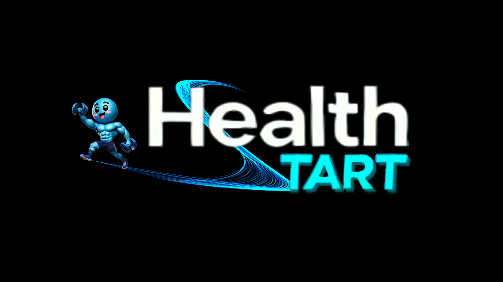

# 🏋️ 헬스타트 _ Healthtart

 
 

# 🐼 Group 4 Team Member - `Dev5oops`

|  |  |  |  |  | 
| :----------------------------------------------------------: | :----------------------------------------------------------: | :----------------------------------------------------------: | :----------------------------------------------------------: | :----------------------------------------------------------: |
|                            조제훈                            |                            백경석                            |                            유제은                            |                            이나현                            |                            이서현                            |
|   ` ESFJ `|   ` ENTP `|   ` INFP `|   ` ENTJ `|   ` INFJ `|

  

# 🛠️ Technical Stack
## 🖌️ Frontend

## ⚙️ Backend

<!---->
<!---->

## 💽 DB
<!---->

<!--!-->

<!-- ## ⛓️‍💥 Server
 -->

## DevOps

<!--  -->

## ⚙ Tool
 &nbsp;  &nbsp;  &nbsp; <!-- &nbsp; -->

  

#  🚩 프로젝트 개요
### [🔗 위키 바로가기](https://github.com/Dev5Oops/Healthtart/wiki/1.-%ED%94%84%EB%A1%9C%EC%A0%9D%ED%8A%B8-%EA%B0%9C%EC%9A%94)

  

# 🚩 기획 문서
### [🔗 위키 바로가기](https://github.com/Dev5Oops/Healthtart/wiki/2.-%EA%B8%B0%ED%9A%8D-%EB%AC%B8%EC%84%9C)

  

# 🚩 DDD (Domain Driven Design) 설계
### [🔗 위키 바로가기](https://github.com/Dev5Oops/Healthtart/wiki/3.-DDD-(Domain-Driven-Design))

  

# 🚩 DB모델링
### [🔗 위키 바로가기](https://github.com/Dev5Oops/Healthtart/wiki/4.-DB-%EB%AA%A8%EB%8D%B8%EB%A7%81)

  

# 🚩UI 디자인 (Figma)
### [🔗 위키 바로가기](https://github.com/Dev5Oops/Healthtart/wiki/5.-UI-%EB%94%94%EC%9E%90%EC%9D%B8-(Figma))

  

# 🚩 프로젝트 아키텍처
### [🔗 위키 바로가기]()

  

# 🚩 API Test

  

# 🚩 Jenkins
## 1️⃣ 스크립트 코드
## 2️⃣ CI/CD 테스트 결과

  

# 🚩 추후 보완사항 및 계획

# 📜 동료평가

**1. 조제훈**

|Team Member| 동료평가 |
| :--------------------------------------: | ------ |
|  백경석  |  |
|  유제은  |  |
|  이나현  |  |
|  이서현  |  |

**2. 백경석**

|Team Member| 동료평가 |
| :--------------------------------------: | ------ |
|  조제훈  |  |
|  유제은  |  |
|  이나현  |  |
|  이서현  |  |

**3. 유제은**

|Team Member| 동료평가 |
| :--------------------------------------: | ------ |
|  조제훈  |   |
|  백경석  |   |
|  이나현  |  |
|  이서현  |  |

**4. 이나현**

|Team Member| 동료평가 |
| :--------------------------------------: | ------ |
|  조제훈  |  |
|  백경석  |  |
|  유제은  |  |
|  이서현  |  |

**5. 이서현**

|Team Member| 동료평가 |
| :--------------------------------------: | ------ |
|  조제훈  |  |
|  백경석  |  |
|  유제은  |  |
|  이나현  |  |

